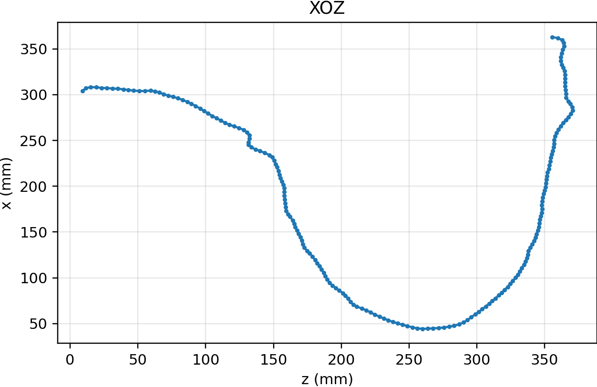

# 冠脉造影：DICOM → XOZ/YOZ 投影中心线 → 3D 参数曲线拟合

> **交付形态**：本项目仅提交 **一个 Jupyter Notebook（.ipynb）**，包含所有函数与流程代码（不依赖额外 `.py` 脚本）。
> **可选增强**：若启用 DeepSA 进行血管分割，需要单独 clone 官方仓库；见下文“DeepSA 预训练模型”。

---

## 1. 运行环境

* 操作系统：Linux（Ubuntu 20.04/22.04）或 Windows 10/11
* Python：**3.8（已验证）**
* 硬件：CPU 可运行；启用 DeepSA 时建议使用 GPU（CUDA）

### 1.1 依赖（建议版本）

```txt
numpy>=1.23
scipy>=1.10
scikit-image>=0.20
opencv-python>=4.7
matplotlib>=3.7
pydicom>=2.4.4
pylibjpeg
pylibjpeg-libjpeg
# （可选）DeepSA 推理需要：
torch
torchvision
Pillow
```

> 建议安装 `pylibjpeg` + `pylibjpeg-libjpeg` 以解码更多 DICOM；或安装 `gdcm` 也可。

### 1.2 快速创建环境（示例）

```bash
conda create -n angiopy38 python=3.8 -y
conda activate angiopy38

pip install numpy scipy scikit-image opencv-python matplotlib pydicom
pip install pylibjpeg pylibjpeg-libjpeg

# 若使用 DeepSA（根据你机器 CUDA 版本选择对应轮子）
# 例如（CUDA 12.1）：
# pip install torch torchvision --index-url https://download.pytorch.org/whl/cu121
pip install pillow
```

---

## 2. DeepSA 预训练模型（可选但推荐）

* 官方仓库：[https://github.com/newfyu/DeepSA](https://github.com/newfyu/DeepSA)
* 克隆并准备权重：

  ```bash
  git clone https://github.com/newfyu/DeepSA.git
  # 确保 DeepSA/ckpt/ 下存在至少一个权重，如：
  # DeepSA/ckpt/fscad_36249.ckpt
  ```
* Notebook 顶部参数区设置：

  ```python
  USE_DEEPSA  = True               # 开启/关闭 DeepSA
  DEEPSA_ROOT = "/abs/path/to/DeepSA"  # 替换为你的绝对路径
  ```
* 若 `USE_DEEPSA=False`：走传统“血管度（Sato/Meijering）+ 阈值 + 形态学”的分割路径。

---

## 3. 数据与目录

**输入**（一个患者文件夹，可能含多张/多帧 DICOM）：

```
patient_folder/
├─ 1.dcm
├─ 2.dcm
├─ 3.dcm
├─ ...
```

> 当有多于 2 张 DICOM 时，用 `pair=(i, j)`（**1-based**）指定两张互相垂直的视图。
> 若为 cine 多帧，可用 `fixed_frames=(k1, k2)` 指定每个视图使用的帧号（建议按“影像数据说明.docx”的推荐帧）。

**输出**（由 `save_dir` 指定）：

```
save_dir/
├─ xoz.csv              # [z, x]（无表头，单位 mm）
├─ yoz.csv              # [z, y]（无表头，单位 mm）
├─ overlay_view1.png    # 视图1裁剪图 + 主干路径
├─ overlay_view2.png
├─ xoz.png              # XOZ 投影曲线图
└─ yoz.png              # YOZ 投影曲线图
```

> **CSV 列顺序固定为：第一列 z，第二列 x/y**（与 3D 拟合器输入完全兼容）。

---

## 4. Notebook 使用步骤

### 4.1 设置参数（Notebook 顶部“参数区”）

```python
# —— 路径与 I/O ——
PATIENT_FOLDER = "/abs/path/to/患者1-血管造影图像"
SAVE_DIR       = "/abs/path/to/patient_1_results"

# —— 选择两张互相垂直的 DICOM（1-based）与平面类型 ——
PAIR          = (5, 4)                # 例：第5与第4张 DICOM 互相垂直
PLANES        = ("XOZ", "YOZ")        # 视图1=XOZ，视图2=YOZ

# —— 可选：指定每个视图使用的 cine 帧号（建议用“影像数据说明.docx”的推荐帧）——
FIXED_FRAMES  = (26, 20)              # 若未知可设 None，走自动挑帧
# FIXED_FRAMES = None

# —— 坐标翻转（如发现 z/x/y 方向与预期相反时调此处）——
FLIPS         = ((+1, +1), (+1, +1))  # ((row_sign, col_sign), ...)

# —— DeepSA 设置（可选但推荐）——
USE_DEEPSA    = True
DEEPSA_ROOT   = "/abs/path/to/DeepSA"
```

> **建议**：若“影像数据说明.docx”给出了每个患者推荐帧，**优先**使用 `FIXED_FRAMES=(k1,k2)`；自动挑帧仅作备选。

### 4.2 跑 DICOM → 中心线 → CSV（含可视化）

Notebook 中已实现“一键处理”与“可视化核对”：

```python
# 1) 处理并导出 CSV（z,x）与（z,y），同时生成 overlay/xoz/yoz PNG
deepsa = DeepSAWrapper(DEEPSA_ROOT) if USE_DEEPSA else None

xoz, yoz = process_patient_dicoms(
    patient_folder = PATIENT_FOLDER,
    pair          = PAIR,
    planes        = PLANES,
    fixed_frames  = FIXED_FRAMES,
    flips         = FLIPS,
    deepsa        = deepsa,
    save_dir      = SAVE_DIR       # 统一输出目录（CSV + 图）
)

# 2) 可视化核对（会复用同样步骤，仅渲染图像）
visualize_full_results(
    patient_folder = PATIENT_FOLDER,
    pair          = PAIR,
    planes        = PLANES,
    fixed_frames  = FIXED_FRAMES,
    deepsa        = deepsa,
    save_dir      = SAVE_DIR       # 将三联图与投影曲线分别保存
)
```

完成后你会在 `SAVE_DIR` 看到：

* `xoz.csv` / `yoz.csv`（**z 首列**，单位 mm）
* `overlay_view1.png` / `overlay_view2.png`（裁剪图 + 主干路径）


* `xoz.png` / `yoz.png`（两投影曲线）



---

## 5. 3D 拟合器（精简版）的使用

Notebook 内置了**精简版** `fit_parametric_3d_multistart`，目标是从两条投影曲线

* `XOZ: (z, x)`
* `YOZ: (z, y)`
  联合拟合单一 3D 参数模型：

$$
x(t)=a t+b\sin(ct),\quad
y(t)=d t+e\cos(ft),\quad
z(t)=g t+h\sin(it),\quad t\in[0,1].
$$

### 5.1 快速上手

```python
from math import pi
theta, rms, ise = fit_parametric_3d_multistart(
    xoz_csv = f"{SAVE_DIR}/xoz.csv",   # 由上一步导出的 CSV
    yoz_csv = f"{SAVE_DIR}/yoz.csv",
    out_dir = SAVE_DIR,                # 拟合相关输出也放在同一目录
    # 关键可调参数（下节详解）：
    n_grid                = 1500,      # t 网格密度（越大越稳但更慢）
    n_starts              = 30,        # 多启动次数/组合
    freq_hi_list          = (6*pi, 10*pi),  # 三轴频率上限的候选（降低过拟合）
    monotone_penalty_list = (10.0, 30.0),   # z'(t) 单调软惩罚强度
    amp_factor            = 2.0,       # 正弦幅度上限 = 轴范围 × amp_factor
    seed                  = 42,        # 随机种子，保证复现
    polish                = True       # 末端小范围“频率抛光”
)

print("Best params θ (a..i):", theta)
print("RMS =", rms, "  ISE =", ise)
```

### 5.2 输出内容

`out_dir` 下将新增（或覆盖）：

* `fitted_parameters.json`
  保存 9 个参数 $a\dots i$、RMS、ISE 以及尝试过的多启动设置（便于复现）。
* `reconstruction_samples.csv`
  列：`t, x_fit, y_fit, z_fit, x_target, y_target, z_target`（可用于绘图或误差分析）。
* `fit_overlays.png`
  三轴 $x(t),y(t),z(t)$ 与目标曲线的重叠对比图。
  
* `reconstructed_3d.png`
  拟合出的 3D 空间曲线可视化。
  

  


> **解释**：
>
> * **RMS** 为 3D 均方根误差（坐标单位 mm）
> * **ISE** 为 $\int_0^1 \|\Delta(t)\|^2 dt$ 的数值近似

### 5.3 关键参数说明

* `n_grid`：更密的 t 网格 → 更平滑的目标函数，通常更稳（但更慢）。建议 1000–3000。
* `n_starts`：多启动次数（对抗局部极小）；线性增加耗时。建议 20–60。
* `freq_hi_list`：三轴频率的上限候选（例如 `6π`、`10π`）。上限越低越能抑制过度摆动。
* `monotone_penalty_list`：z 单调软惩罚强度（防止 z 回头，常用 10–60）。
* `amp_factor`：限制正弦幅度与轴范围的比例（避免巨幅摆动）。
* `polish`：末端“固定频率→解线性系数→微调频率”的小范围抛光，通常能再降一点误差。

**提示**：`alpha_radius` / `beta_prob` 等是**分割→中心线**阶段的参数（影响 CSV 质量）；这里只列出了 3D 拟合器相关的参数。

### 5.4 原理小结（一句话版）

* 用 `XOZ/YOZ` 的 z 交集构造统一 z 网格 → 归一化为 $t\in[0,1]$，在该网格上**同时**拟合 $x(t),y(t),z(t)$；
* 二阶项靠正弦补充柔性，z'(t) 加软惩罚保持“向前”；
* 多启动 + 频率抛光，减少局部极小影响。

---

## 6. 方法概览（前端提取）

* **预处理**：归一化、CLAHE、轻度高斯、去边框/刻字。
* **分割（可选 DeepSA）**：DeepSA 概率与多尺度脊线（Sato/Meijering）融合，小形态学清理，`clear_border`。
* **主干中心线**：

  1. **测地主干**（推荐）：代价 = α·(1−DT) + β·(1−prob)，起点偏向边缘端点（冠脉入口），遍历终点候选择优；
  2. **骨架最长路径**（兜底）：`skeletonize` + 迭代剪枝 + 端点对最远测地；
     输出按**等弧长**重采样，保证下游稳定。
* **投影与坐标**：
  DICOM `PixelSpacing` → (row, col) → (mm)；
  `planes=("XOZ","YOZ")` 决定第二列是 x 还是 y；
  z 默认用 row(mm)，也可换成弧长(mm)。

---

## 7. 常见问题（FAQ）

1. **DICOM 解码失败**

   * 安装 `pylibjpeg` 与 `pylibjpeg-libjpeg`（或 `gdcm`）。

2. **没有 IOP/IPP（方向矩阵）**

   * 自动回退到 `PixelSpacing + 单调 z`；如方向颠倒，调整 `FLIPS`（例如行方向 -1）。

3. **mask 断裂 / 主干不连**

   * 略增 `binary_closing`、减小 `min_object_area`；
   * 或切换为“骨架最长路径”兜底；
   * DeepSA 推理时建议打开 **Multi-angle** 与 **Pad margin**（Notebook 已实现等效）。

4. **投影曲线与 overlay 视觉不一致**

   * 确认 `PLANES=("XOZ","YOZ")` 是否与实际一致；
   * 确认 z 使用 `row(mm)` 还是 `arc(mm)`；
   * 若仍不一致，检查 `FLIPS` 的符号设置。

5. **3D 拟合收敛慢/结果晃动**

   * 降低 `freq_hi_list` 上限、降低 `amp_factor`；
   * 增加 `monotone_penalty_list`；
   * 先把 `n_grid` 调小做快速尝试，再增大精修。
6. **DeepSA 导入失败**  
    * 将克隆的DeepSA文件夹里`utils.py` 的 `from datasets import tophat` 改成 `from DeepSA.datasets import tophat`

---

## 8. 评测最小示例（含 3D 拟合）

```python
# —— 前端：生成 CSV + 可视化 ——
deepsa = DeepSAWrapper(DEEPSA_ROOT) if USE_DEEPSA else None

xoz, yoz = process_patient_dicoms(
    patient_folder = PATIENT_FOLDER,
    pair          = PAIR,
    planes        = PLANES,
    fixed_frames  = FIXED_FRAMES,
    flips         = FLIPS,
    deepsa        = deepsa,
    save_dir      = SAVE_DIR
)

visualize_full_results(
    patient_folder = PATIENT_FOLDER,
    pair          = PAIR,
    planes        = PLANES,
    fixed_frames  = FIXED_FRAMES,
    deepsa        = deepsa,
    save_fig      = SAVE_DIR
)

# —— 3D 拟合（精简版）——
from math import pi
theta, rms, ise = fit_parametric_3d_multistart(
    xoz_csv = f"{SAVE_DIR}/xoz.csv",
    yoz_csv = f"{SAVE_DIR}/yoz.csv",
    out_dir = SAVE_DIR,
    n_grid  = 1500,
    n_starts = 30,
    freq_hi_list = (6*pi, 10*pi),
    monotone_penalty_list = (10.0, 30.0),
    amp_factor = 2.0,
    seed = 42,
    polish = True
)
print("θ =", theta)
print("RMS =", rms, "ISE =", ise)
```


---

## 9. 关键可调（建议默认）

* 分割：`min_object_area=300~600`，`open_disk_radius=1~2`，`clear_border=True`。
* 主干（测地）：`alpha≈0.9~0.95`，`beta≈0.1~0.2`，`n_end_candidates=20~40`，`edge_bias=True`。
* 投影：`z_mode="row"`（默认），必要时可改 `z_mode="arc"`。
* 拟合：`n_grid=1000~3000`，`n_starts=20~60`，`freq_hi_list=(6π,10π)`，`monotone_penalty_list=(10,30)`，`amp_factor≈2.0`，`polish=True`。

